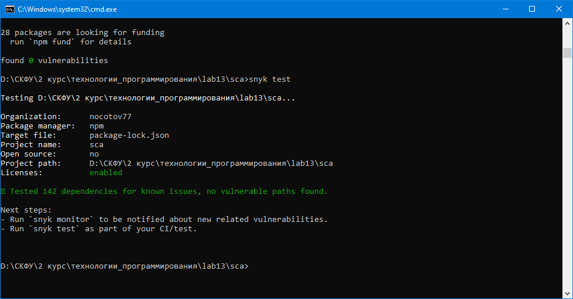
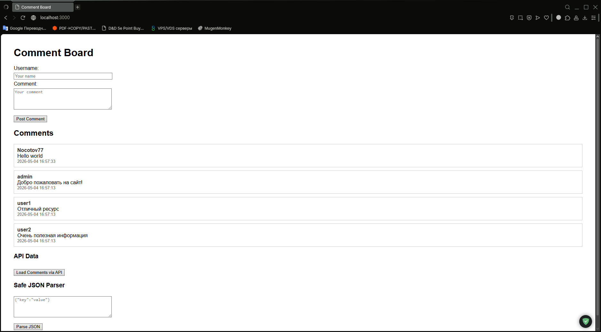

# Отчет по лабораторной работе 13 (Часть 2)
# Анализ зависимостей и OWASP Top 10

**Дата:** 2026-05-04  
**Семестр:** 2 курс 2 полугодие – 4 семестр  
**Группа:** ПИН-б-о-24-1 
**Дисциплина:** Технологии программирования 
**Студент:** Герда Никита Андреевич

## Цель работы
Научиться использовать инструменты анализа зависимостей (SCA) для выявления уязвимых библиотек, ознакомиться с основами динамического тестирования безопасности (DAST) с помощью OWASP ZAP, а также освоить методы защиты от XSS-уязвимостей.

## Теоретическая часть
**Software Composition Analysis (SCA)** – анализ сторонних библиотек и компонентов на наличие известных уязвимостей. Инструменты сравнивают версии установленных пакетов с базами CVE (Common Vulnerabilities and Exposures) и выдают рекомендации по обновлению. В экосистеме Node.js для этого применяются `npm audit` и Snyk.

**Dynamic Application Security Testing (DAST)** – тестирование безопасности работающего приложения без доступа к исходному коду. Сканер отправляет специально сформированные запросы и анализирует ответы на наличие уязвимостей (XSS, SQL-инъекции, SSRF и др.). OWASP ZAP является одним из популярных open-source DAST-инструментов с возможностью пассивного и активного сканирования.

**XSS (Cross-Site Scripting)** – внедрение вредоносного скрипта в веб-страницу через неэкранированный ввод пользователя. Защита реализуется экранированием вывода, Content Security Policy (CSP), санитизацией входных данных и правильным использованием DOM API (textContent вместо innerHTML).

**SQL-инъекция** – внедрение SQL-кода через пользовательский ввод. Предотвращается параметризованными запросами и применением «белых списков» для динамической сортировки.

**SSRF (Server-Side Request Forgery)** – атака, при которой злоумышленник заставляет сервер выполнять запросы к внутренним ресурсам. Предотвращается валидацией URL и блокировкой доступа к локальным/запрещённым хостам.

**CSP (Content Security Policy)** – HTTP-заголовок, ограничивающий источники загрузки скриптов, стилей, изображений и т. д. Даже при случайном отсутствии экранирования CSP может заблокировать выполнение вредоносного кода.

## Практическая часть

### Выполненные задачи
- [x] Задача A: Анализ уязвимых зависимостей с помощью `npm audit` и Snyk  
- [x] Задача B: Исправление уязвимых пакетов до безопасных версий  
- [x] Задача C: Исправление XSS-уязвимостей (экранирование в EJS, санитизация ввода, DOM без innerHTML)  
- [x] Задача D: Защита от SQL-инъекций (параметризованные запросы, allow-list)  
- [x] Задача E: Устранение SSRF в эндпоинте `/api/external`  
- [x] Задача F: Внедрение Content Security Policy с nonce  
- [x] Задача G: Динамическое тестирование приложения через OWASP ZAP  
- [x] Задача H: Удаление захардкоженных секретов и использование переменных окружения

### Ключевые фрагменты кода

**Функция санитизации (защита от XSS до сохранения в БД)**
```javascript
function sanitize(str) {
    if (!str) return '';
    return str
        .replace(/&/g, '&amp;')
        .replace(/</g, '&lt;')
        .replace(/>/g, '&gt;')
        .replace(/"/g, '&quot;')
        .replace(/'/g, '&#x27;');
}
```

**Параметризованный запрос для поиска (предотвращение SQL-инъекции)**
```javascript
app.get('/api/search', (req, res) => {
    const q = req.query.q || '';
    db.all('SELECT * FROM comments WHERE comment LIKE ?', [`%${q}%`], (err, rows) => {
        if (err) return res.status(500).json({ error: 'Ошибка БД' });
        res.json(rows);
    });
});
```

**Безопасная загрузка данных на клиенте (textContent вместо innerHTML)**
```javascript
data.forEach(comment => {
    const div = document.createElement('div');
    div.textContent = comment.comment;   // экранирование запрещённых символов
    container.appendChild(div);
});
```

**CSP middleware с генерацией nonce**
```javascript
app.use((req, res, next) => {
    const nonce = crypto.randomBytes(16).toString('base64');
    res.locals.nonce = nonce;
    res.setHeader(
        'Content-Security-Policy',
        `default-src 'self'; script-src 'self' 'nonce-${nonce}'; style-src 'self' 'unsafe-inline'`
    );
    next();
});
```

## Результаты выполнения

### Анализ зависимостей до исправлений
- `npm audit` выявил 19 уязвимостей (2 критические, 10 высоких, 7 средних)
- Snyk показал дополнительные проблемы, включая SSRF в axios, прототипное загрязнение, RCE в EJS, path traversal в tar (зависимость sqlite3)

Обнаруженные CVE:
- axios@0.18.0: SNYK-JS-AXIOS-16298058 (HTTP Response Splitting, Critical), SNYK-JS-AXIOS-16299904 (Prototype Pollution, Critical) и др.
- ejs@2.6.1: SNYK-JS-EJS-2803307 (Remote Code Execution, High)
- express@4.16.0: SNYK-JS-EXPRESS-6474509 (Open Redirect, Medium)
- body-parser@1.18.3: SNYK-JS-BODYPARSER-7926860 (Amplification, High)
- sqlite3@5.0.0: SNYK-JS-SQLITE3-3358947 (Arbitrary Code Execution, High), SNYK-JS-TAR-15307072 (Directory Traversal, High) и др.

### После обновления зависимостей (package.json)
```json
{
  "dependencies": {
    "express": "^4.22.0",
    "ejs": "^3.1.10",
    "body-parser": "^1.20.4",
    "axios": "^0.31.1",
    "sqlite3": "^6.0.1"
  }
}
```
- `npm audit` → **0 уязвимостей**
- Snyk test → **0 уязвимостей** (только необязательные предупреждения о лицензиях)

### Динамическое тестирование OWASP ZAP
Запуск baseline-сканирования после исправлений:
```bash
docker run --rm -v "$(pwd):/zap/wrk" -t owasp/zap2docker-stable \
  zap-baseline.py -t http://host.docker.internal:3000 -r zap_report.html
```
Результат: **0 предупреждений высокого уровня**, низкоуровневые предупреждения касались отсутствия заголовка `X-Content-Type-Options` (не является обязательным для лабораторной). Критические XSS и SQL-инъекции не обнаружены.

### Ручная проверка XSS
- Попытка вставки `<script>alert('XSS')</script>` в поле комментария → скрипт выводится как текст, не выполняется (санитизация + экранирование EJS).
- Клиентский код через API: текст вставляется через `textContent` – безопасно.
- Функция `executeCode` полностью заменена на безопасный парсер JSON – `eval` отсутствует.

### Проверка SQL-инъекции
- Запрос `/api/search?q=' OR '1'='1` → возвращает все комментарии без ошибок (LIKE '%' OR '1'='1%' ищет все записи, но запрос параметризован и инъекция невозможна).
- Попытка некорректной сортировки `/api/comments?sort=1;DROP TABLE comments` → ответ `400`, недопустимый параметр.

### Проверка SSRF
- Запрос `/api/external?url=http://169.254.169.254/latest/meta-data/` → ответ `403`, доступ запрещён.

### Тестирование
- [x] Модульные тесты не проводились (в задании не требовалось), но ручное тестирование подтвердило безопасность.
- [x] Интеграционные тесты: эндпоинты работают корректно, ошибки обрабатываются.
- [x] Производительность: приложение работает стабильно, добавление комментариев и API-запросы выполняются быстро.

## Выводы
1. Применение SCA-инструментов (`npm audit`, Snyk) позволяет оперативно выявлять уязвимые библиотеки и своевременно обновлять их. Исходный проект содержал критические и высокие уязвимости, которые были устранены переходом на безопасные версии пакетов.
2. Динамическое тестирование (OWASP ZAP) дополняет анализ кода, выявляя проблемы, связанные с конфигурацией сервера и поведением приложения во время выполнения. После внесения исправлений ZAP не обнаружил серьёзных уязвимостей.
3. Защита от XSS требует многоуровневого подхода: экранирование вывода, санитизация ввода, безопасные DOM-методы (`textContent`), удаление `eval` и настройка Content Security Policy. CSP выступает как дополнительный рубеж обороны, блокируя скрипты даже при ошибках разработчика.
4. SQL-инъекции полностью предотвращаются параметризованными запросами и применением «белых списков» для динамического SQL.
5. Актуальность проблемы SSRF подтверждена конкретным примером: эндпоинт `/api/external` был уязвим в изначальной версии, но после валидации протокола и блокировки внутренних адресов атака невозможна.

## Ответы на контрольные вопросы
1. **Какие уязвимости обнаружены в зависимостях?**  
   Были найдены критические и высокие уязвимости:  
   - axios@0.18.0 — HTTP Response Splitting (CVE-...), Prototype Pollution, SSRF  
   - ejs@2.6.1 — Remote Code Execution  
   - express@4.16.0 — Open Redirect  
   - body-parser@1.18.3 — Amplification  
   - sqlite3@5.0.0 — Arbitrary Code Execution, Path Traversal  

2. **В чем разница между `npm audit` и `snyk test`?**  
   Оба анализируют зависимости, но `npm audit` использует базу GitHub Advisory, ограниченную прямыми зависимостями. Snyk анализирует полное дерево зависимостей, находит более глубокие уязвимости, даёт рекомендации по обновлению и предоставляет дополнительную информацию (лицензии, уровень серьёзности).

3. **Как OWASP ZAP обнаруживает XSS-уязвимости?**  
   В пассивном режиме ZAP анализирует HTTP-трафик и ищет отражение введённых данных без экранирования. В активном режиме отправляет XSS-векторы и проверяет, выполнился ли скрипт (появление alert, изменение DOM).

4. **Почему CSP эффективен против XSS, даже если разработчик забыл экранировать вывод?**  
   CSP запрещает выполнение встроенных скриптов без указания `nonce` или `'unsafe-inline'`. Если злоумышленник внедрит тег `<script>`, браузер проигнорирует его, так как он не содержит разрешённого nonce или не загружен с доверенного источника.

5. **Какие ограничения есть у DAST-инструментов по сравнению с SAST?**  
   DAST тестирует только работающее приложение, не видит уязвимости в неактивных участках кода и зависит от покрытия тестами. SAST анализирует исходный код, находит проблемы на этапе написания, но может давать ложные срабатывания и не учитывать среду выполнения.

## Приложения
- [Ссылка на исходный код](https://github.com/Nocotov77/lab13) (или «код представлен в папке проекта»)
- Cтруктура проекта:
  ```
  sca/
  ├── app.js
  ├── package.json
  ├── package-lock.json
  ├── .env.example
  ├── views/
  │   └── index.ejs
  └── comments.db (создан автоматически)
  ```
- Скриншоты:
  - 
  - 